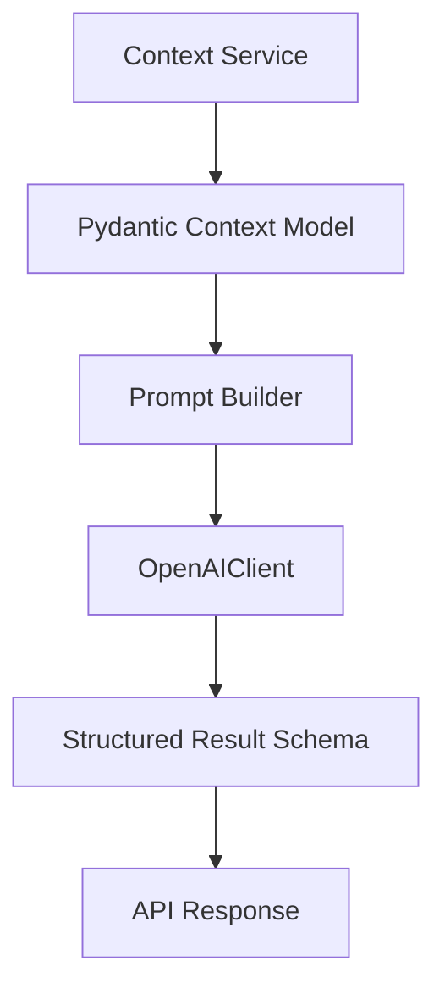

# AI Overview

The v1 AI layer is intentionally narrow.

It exists to analyze already-structured workout and phase context. It does not yet
generate training content, retrieve historical memory, call tools, or mutate system
state.

## Scope in V1

Current AI capabilities:

- analyze a specific phase context
- analyze a specific workout context
- accept an optional user instruction to steer the analysis
- validate the model response against a strict schema

Not in scope for v1:

- RAG
- plan generation
- workout generation
- autonomous coaching actions
- multi-step agent workflows
- write-back into the system

## Architecture



## Main Components

### `ai/llm/openai_client.py`

Thin wrapper around the OpenAI Responses API.

Responsibilities:

- fail fast when `OPENAI_API_KEY` is missing
- initialize the OpenAI client with the configured model and timeout
- call `responses.parse(...)`
- validate structured output against a Pydantic schema
- normalize provider failures into `AIConfigurationError` or `AIProviderError`

### `ai/prompts/context_analysis.py`

Shared prompt-building layer for workout and phase analysis.

Important characteristics:

- serializes context models with deterministic JSON formatting
- uses explicit system prompts for `phase` and `workout` analysis
- supports an optional user-supplied instruction
- tells the model to use only the provided context and not invent facts

### `ai/services/phase_context_analysis.py`

Builds `PhaseContextResponse` through `PhaseContextService`, then passes it into the
phase prompt builder and OpenAI client.

### `ai/services/workout_context_analysis.py`

Builds `WorkoutContextResponse` through `WorkoutContextService`, then passes it into the
workout prompt builder and OpenAI client.

### `ai/schemas.py`

Shared structured result models:

- `PhaseContextAnalysisResult`
- `WorkoutContextAnalysisResult`

These shape the transport DTOs exposed in the API layer.

## API Surface

### Analyze Phase Context

- `POST /api/v1/ai/analysis/specific-phase-context/{phase_id}`

Request:

```json
{
  "instruction": "optional"
}
```

Response:

- `summary`
- `phase_focus`
- `positives`
- `concerns`
- `recommendation`

### Analyze Workout Context

- `POST /api/v1/ai/analysis/specific-workout-context/{workout_id}`

Request:

```json
{
  "instruction": "optional"
}
```

Response:

- `summary`
- `workout_focus`
- `positives`
- `concerns`
- `recommendation`

## Configuration

Relevant settings:

- `OPENAI_API_KEY`
- `OPENAI_MODEL` default `gpt-4.1-mini`
- `OPENAI_TIMEOUT_SECONDS` default `30`

If `OPENAI_API_KEY` is not configured, the AI endpoints are unavailable and return a
service-level failure instead of silently degrading.

## Prompt Contract

The current prompt contract is intentionally strict:

- use only the provided context
- do not invent missing facts
- if the context is incomplete, say so
- keep the output compact and structured
- match the requested schema exactly

That makes the AI layer more compatible with product and backend consumption than a
free-form text response.

## Failure Modes

The AI layer currently surfaces three main classes of failure:

- configuration failure, such as missing API key
- upstream provider request failure
- invalid or missing structured output from the provider

At the API layer these are translated into `503` responses.

## Why The Design Works

The strongest part of the current AI implementation is what it does not do:

- it does not prompt directly from raw ORM objects
- it does not prompt from raw Notion payloads
- it does not skip schema validation

By forcing AI to operate on backend-owned context DTOs, v1 keeps the AI layer grounded
and easier to evolve.

## Next Likely Evolution Steps

When the project moves beyond v1, the natural next steps are:

- richer athlete context
- historical grounding and retrieval
- generation of structured workout or phase content
- evaluation and prompt/version management
- controlled tool-calling or agentic workflows
