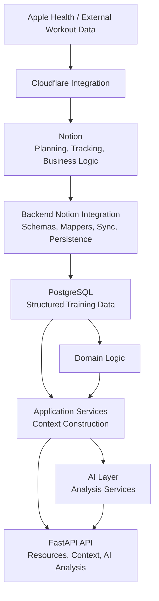
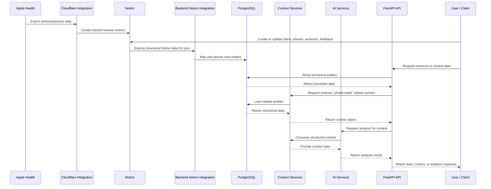

# Current Architecture

This document is the living architecture narrative for the current backend. Unlike the
release docs, it should be updated in place as the implementation evolves.

For product milestone scope, use [../releases/v1.md](../releases/v1.md). For the
implementation-oriented layer map, use [system-map.md](system-map.md).

## 1. Overview

The current system is a backend-first personal training management platform that operates alongside a fully functional Notion-based workflow.

Training planning, tracking, and a significant portion of business logic currently live in Notion, which serves as the primary user interface and operational tool. At the same time, a custom backend system mirrors and structures this data in a PostgreSQL database.

The backend is responsible for:

- persisting structured representations of training data
- synchronizing data from Notion
- providing domain-level abstractions such as workout, phase week, and phase context
- exposing APIs for accessing data and analysis
- enabling initial AI-driven analysis capabilities

The system is designed for single-user, personal use and serves as the foundation for a future independent platform.

## 2. System Context

The current system consists of multiple components working together, with Notion acting as the central operational tool.

### Notion

Notion serves as the primary interface and current source of truth for:

- training planning (plans, phases, workouts)
- tracking execution (sessions)
- weekly feedback
- basic analysis through views and formulas

It contains multiple interconnected databases representing the core training model and includes business logic implemented through formulas (e.g., status calculation and training load).

---

### External Data Sources

Training session data is collected through external systems:

- Apple Health data is exported via an automated pipeline
- A Cloudflare-based integration processes this data and creates tracked session entries in Notion

This setup enables automatic ingestion of workout data into the system, but currently relies on Notion as the entry point.

---

### Backend System

A custom backend system runs alongside Notion and mirrors its core data.

It consists of:

- a PostgreSQL database storing structured training data
- SQLAlchemy models representing core entities such as plans, phases, workouts, sessions, and feedback
- a Notion integration layer that retrieves, maps, and persists data into the backend

The backend is responsible for structuring data, enabling analysis, and serving as the foundation for future system ownership.

---

### API Layer

The backend exposes a FastAPI-based API that provides:

- access to core resources (plans, phases, workouts, sessions)
- structured context objects (workout, phase week, phase)
- AI-based analysis endpoints

These APIs are currently used for development and analysis purposes and are designed to support future frontend and AI integrations.

---

### Overall Interaction

The system currently follows this flow:

## 3. Main Building Blocks

The backend system is organized into a set of layers with clear responsibilities, enabling separation of concerns and future extensibility.

---

### Database Layer

The database layer is responsible for persistent storage of structured training data.

- PostgreSQL database (Docker-based)
- SQLAlchemy models representing core entities:
  - Event
  - Plan
  - Phase
  - Nutrition Guidline
  - Workout
  - Tracked Session
  - Feedback
- Repository pattern for data access

This layer mirrors the core structure currently defined in Notion and serves as the foundation for future system ownership.

---

### Integration Layer

The integration layer handles synchronization between Notion and the backend.

- Pydantic schemas for Notion data
- Mapping logic from Notion objects to domain models
- Sync and persistence services

This layer enables the backend to stay in sync with Notion while transforming data into a structured format.

---

### Domain Layer

The domain layer contains business logic and domain-specific computations.

- Aggregation of training data (e.g., load across workouts)
- Status calculations (partially implemented)
- Core domain concepts and logic

Currently, some business logic still resides in Notion, but the domain layer is intended to become the central location for all such logic over time.

---

### Application Layer (Services)

The application layer orchestrates use cases and constructs higher-level representations of data.

Key components include:

- Workout Context Service
- Phase Context Service:
  - Phase Context
  - Phase Week Context

These services aggregate data from the database and domain layer into structured context objects that can be used for analysis and AI.

---

### AI Layer

The AI layer provides analysis capabilities based on structured context data.

- LLM integration (OpenAI)
- Prompt definitions and response schemas
- Analysis services:
  - Workout analysis
  - Phase analysis

The AI layer consumes structured context objects rather than raw database data, ensuring consistency and clarity.

---

### API Layer

The API layer exposes the system’s functionality through a FastAPI application.

It includes endpoints for:

- Core resources (plans, phases, workouts, sessions)
- Context retrieval (workout, phase week, phase)
- AI analysis

Currently, the API is primarily used for development and internal consumption but is designed to support future frontend integration.

---

### Testing

The system includes automated tests to ensure correctness and stability.

Testing is currently being expanded and refined as part of the V1 stabilization phase.

## 4. Core Domain Model

The current system is built around a set of core training concepts that represent planning, execution, and feedback.

### Event

An Event represents a certain type of race or competiton that a plan is usually working towards or supporting. 

### Plan

A plan represents the highest-level training structure. It defines the overall training block and groups one or more phases.

---

### Phase

A phase represents a structured segment within a plan, typically aligned with a specific training objective or time period.

A phase contains:

- multiple workouts
- optional nutrition guidance
- weekly feedback entries

---

### Workout

A workout is the primary planning unit within the system.

Workouts are organized primarily on a weekly basis rather than requiring an exact planned date. Each workout can include:

- a planned week start date
- an optional planned date
- a link to a parent phase
- links to tracked sessions
- planned training metadata such as RPE, duration, and distance

A workout also serves as the point where planned training is compared to actual execution.

---

### Tracked Session

A tracked session represents the actual execution data of a workout.

Sessions are typically imported from external data sources and linked to a planned workout. They contain actual performance information such as duration, distance, and heart-rate-related metrics.

---

### Feedback

Feedback captures qualitative input on a weekly basis.

It is linked to a phase and is used to store both structured feedback fields and free-text reflections related to recovery, freshness, and general training experience.

---

### Nutrition Guidelines

Nutrition guidelines represent supporting training guidance and can be linked to one or more phases.

---

### Events

Events represent higher-level milestones or external anchors associated with a plan.

---

### Context Objects

In addition to persistent entities, the system defines higher-level context representations used for analysis and AI.

These currently include:

- Workout Context
- Phase Week Context
- Phase Context

These context objects combine data from multiple entities into analysis-ready structures.

## 5. Main Flows

The system currently operates through a set of core flows that connect external data, Notion, the backend, and AI capabilities.

---

### 5.1 Data Ingestion and Synchronization

Training data originates from external systems and is first processed through Notion.

- Apple Health data is exported via an automated pipeline
- A Cloudflare-based integration creates tracked session entries in Notion
- Planning data (plans, phases, workouts) is created manually in Notion

The backend retrieves this data through the Notion integration layer, maps it to structured models, and persists it into the PostgreSQL database.

---

### 5.2 Context Generation

Structured data stored in the database is transformed into higher-level context objects.

- Application services aggregate data from multiple entities
- Domain logic is applied where necessary
- Context objects are created:
  - Workout Context
  - Phase Week Context
  - Phase Context

These context objects serve as the primary inputs for analysis and AI processing.

---

### 5.3 API Access

The backend exposes data and context through a FastAPI-based API.

- Resource endpoints provide access to core entities
- Context endpoints provide structured context objects
- These endpoints are designed for both internal use and future frontend integration

---

### 5.4 AI Analysis

AI services consume structured context data to generate analysis outputs.

- Context objects are passed to AI services
- Prompts and schemas define the structure of analysis
- Outputs include explanations and insights for:
  - individual workouts
  - phases

AI operates on structured context rather than raw database data, ensuring consistency and clarity.

---

### 5.5 Feedback Loop

User interaction and feedback are captured within Notion.

- Weekly feedback is entered manually
- Sessions are linked to workouts
- Workout status is updated based on execution

This updated data is synchronized back into the backend, ensuring that analysis reflects the latest state of training.

---

### 5.6 Sequence Diagram

## 6. AI Integration

The current system already includes an initial AI layer focused on analysis.

AI capabilities are currently implemented as dedicated services that consume structured context objects rather than raw database entities. This design keeps AI interactions grounded in well-defined inputs and avoids coupling prompts directly to persistence models or API schemas.

The AI layer currently includes:

- LLM client integration (OpenAI)
- prompt definitions
- request and response schemas
- analysis services for:
  - workout context
  - phase context

The current role of AI is limited to analysis and interpretation. It does not yet perform autonomous planning, adaptation, or tool-based interaction.

This early integration establishes the architectural foundation for future AI expansion, including richer analysis, retrieval-based workflows, and agentic systems.

## 7. Strengths of the Current Design

The current design already provides several strong foundations for future development.

### Practical Usability

The system is already usable in day-to-day practice through the Notion-based workflow. This ensures that development is grounded in real usage rather than hypothetical requirements.

---

### Structured Domain Model

The core training concepts such as plans, phases, workouts, sessions, and feedback are already modeled in a structured and relational way. This provides a solid conceptual foundation for both backend logic and future frontend development.

---

### Clear Separation of Layers

The backend is organized into distinct layers for integration, persistence, domain logic, application services, AI, and API exposure. This separation improves maintainability and makes future evolution easier.

---

### Context-Based Architecture

The introduction of workout, phase week, and phase context objects is a major architectural strength. These abstractions provide analysis-ready representations of training data and create a strong foundation for AI integration.

---

### Early AI Foundation

Even in its current state, the system already includes a clean initial AI integration based on structured context rather than raw persistence models. This is a strong starting point for more advanced AI workflows later.

---

### Incremental Evolution Path

Because the system runs alongside Notion rather than attempting an immediate replacement, it supports gradual migration and continuous improvement without breaking existing workflows.

## 8. Current Limitations

While the current system provides a strong foundation, it still has several important limitations that need to be addressed in future iterations.

### Dependency on Notion

Notion currently acts as both the primary user interface and the source of truth for planning, tracking, and a significant portion of business logic.

This creates several constraints:

- limited control over data structure and validation
- reliance on Notion formulas for core logic such as metrics and status
- indirect data flow through Notion for external integrations

---

### Distributed Business Logic

A significant portion of business logic, including training load calculations and status determination, is still implemented in Notion.

This leads to:

- duplication of logic between Notion and backend
- reduced transparency and testability
- limited ability to extend and evolve logic cleanly

---

### Indirect Data Ingestion

External training data (e.g., Apple Health) is ingested via Notion rather than directly into the backend.

This introduces:

- unnecessary dependencies
- limited access to raw and richer data
- constraints on advanced analysis

---

### Incomplete Backend Ownership

Although the backend mirrors and structures data, it does not yet fully own:

- data validation and constraints
- business logic execution
- lifecycle management of entities

---

### Limited Frontend Capabilities

There is currently no custom frontend. All user interaction is handled through Notion.

This limits:

- user experience and flexibility
- control over workflows
- ability to integrate advanced features such as interactive analysis and AI-driven interactions

---

### Early-Stage AI Integration

AI capabilities are currently limited to basic analysis use cases.

Missing capabilities include:

- retrieval-based memory (RAG)
- structured generation of training content
- adaptive or recommendation-driven workflows
- agentic AI and tool-based interaction

---

### Evolving Data Model

The current data model is influenced by Notion constraints and does not yet enforce stricter validation and consistency rules expected in a fully controlled backend system.

---

### Limited Visualization and Advanced Analysis

While some analysis exists, the system currently lacks:

- dedicated visualization (e.g., graphs, trends)
- advanced insights and alerting mechanisms
- integrated analysis workflows within a custom interface
