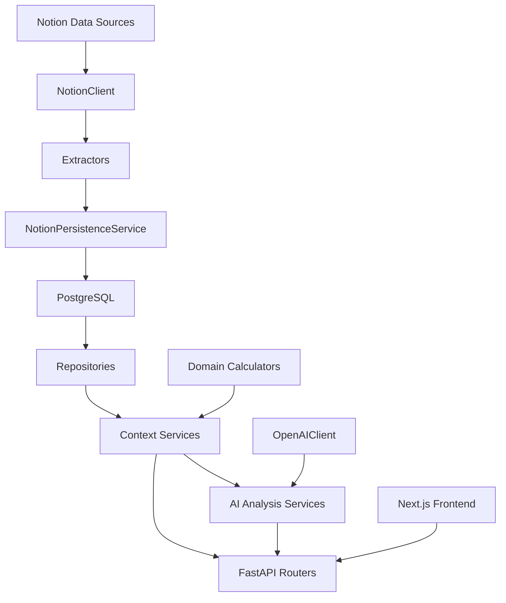

# System Map

This document explains how the current backend and initial frontend are organized at
the code level and how data moves through the main subsystems.

For the broader architectural narrative, see
[current-architecture.md](current-architecture.md). This file focuses on the
implementation boundaries that matter when reading or changing the code.

## High-Level Flow



## Layer Map

### `src/ldk_athlete_ai_coach/main.py`

Creates the FastAPI app, configures logging from settings, mounts the v1 router under
`/api`, and exposes a minimal root endpoint.

### `frontend/`

The Next.js frontend contains the initial V2 app shell and read-only dashboard shape.

- `app/`: App Router entry points, including the root redirect and the Dashboard,
  Planner, Analyzer, and Coach routes
- `components/app-shell/`: shared navigation and placeholder page structure
- `components/dashboard/`: reusable dashboard sections
- `lib/api/`: frontend API client and health check call
- `lib/mock-data/`: isolated placeholder data used until dashboard-specific backend
  contracts exist
- `hooks/`: client-side backend connectivity hook
- `types/`: shared frontend TypeScript contracts

### `api/`

The transport layer.

- `api/v1/routers/`
  - `resources/`: raw plan, phase, workout, and session access
  - `context/`: aggregated phase, phase-week, and workout context
  - `ai/analysis.py`: AI analysis endpoints
  - `sync/notion.py`: blocking Notion sync
  - `system/health.py`: health check
- `api/v1/schemas/`
  - response and request DTOs used by the API layer

The API is mostly read-oriented in v1. The only operational write-like endpoint is the
Notion sync trigger.

### `application/`

The orchestration layer that builds analysis-ready responses.

- `application/services/phase_context_service.py`
- `application/services/workout_context_service.py`

These services coordinate repository access, domain calculations, and data-gap
reporting to build richer snapshots than a raw ORM model can provide.

### `domain/`

Business logic and shared domain concepts.

- `domain/calculators/status_calculator.py`
- `domain/calculators/training_metrics_calculator.py`
- `domain/enums/status.py`
- `domain/models/training_metrics.py`

This is where phase, plan, and workout lifecycle rules live and where training-load
adherence is calculated.

### `core/`

Cross-cutting runtime concerns plus integration infrastructure.

- `core/config.py`: `pydantic-settings` configuration and derived database URL
- `core/logging.py`: global logging setup
- `core/integrations/notion/`
  - low-level Notion client
  - extraction logic
  - schema mapping
  - persistence boundary
  - full sync orchestration

### `db/`

Persistence layer and SQLAlchemy wiring.

- `db/base.py`: declarative base
- `db/session.py`: engine and request-scoped sessions
- `db/models/training.py`: ORM models
- `db/repositories/`: typed read/query repositories

### `ai/`

AI-specific infrastructure layered on top of structured backend context.

- `ai/llm/openai_client.py`
- `ai/prompts/context_analysis.py`
- `ai/services/phase_context_analysis.py`
- `ai/services/workout_context_analysis.py`
- `ai/schemas.py`

The AI layer consumes context objects from the application layer instead of talking
directly to the ORM or Notion payloads.

### `utils/`

Shared helpers. In v1 this is mostly date arithmetic used by repositories and context
services.

## Runtime Boundaries

### Source of truth

In v1, Notion is still the operational source of truth for planning and tracking. The
backend mirrors that data into PostgreSQL and adds backend-owned context, metrics, and
analysis.

### Persistence boundary

`NotionPersistenceService` is the main integration boundary between extracted Notion
schemas and ORM entities. It is responsible for:

- resolving foreign keys by Notion page ID
- calling the right mapper for each schema type
- deciding whether an entity is new or an update
- flushing changes inside the current transaction

### Application boundary

Context services are the point where the raw database model becomes an API-oriented
training snapshot. This is where the code starts to answer user questions such as:

- What is the current phase status?
- Which workouts are still open?
- Which completed workouts have linked sessions?
- What adherence metrics apply to this timeframe?
- What data quality gaps should be called out?

### AI boundary

The AI layer takes structured context models, serializes them deterministically to JSON,
wraps them in a prompt, and requests a schema-validated response from the OpenAI
Responses API.

## Main Route Groups

The current API surface under `/api/v1` is:

- `resources`
  - direct access to plans, phases, workouts, and sessions
- `context`
  - aggregated workout, phase-week, and phase snapshots
- `ai`
  - analysis of workout and phase context
- `sync`
  - one-way Notion sync trigger
- `system`
  - health check

## Dependency Direction

The codebase mostly follows this direction:

```text
api -> application -> domain/db/core
ai -> application -> domain/db/core
core.integrations.notion -> db
db does not depend on api or ai
domain does not depend on api routing
```

That direction is worth preserving. It keeps the AI and API layers replaceable and
prevents transport concerns from leaking into the core model.

## What V1 Does Not Yet Own

Even though the backend is structured well, v1 intentionally stops short of full
platform ownership:

- Notion still owns primary planning and tracking writes
- external session ingestion still lands in Notion first
- the API does not yet provide first-class write workflows for plans/phases/workouts
- AI performs analysis only; it does not generate, adapt, or execute plans
