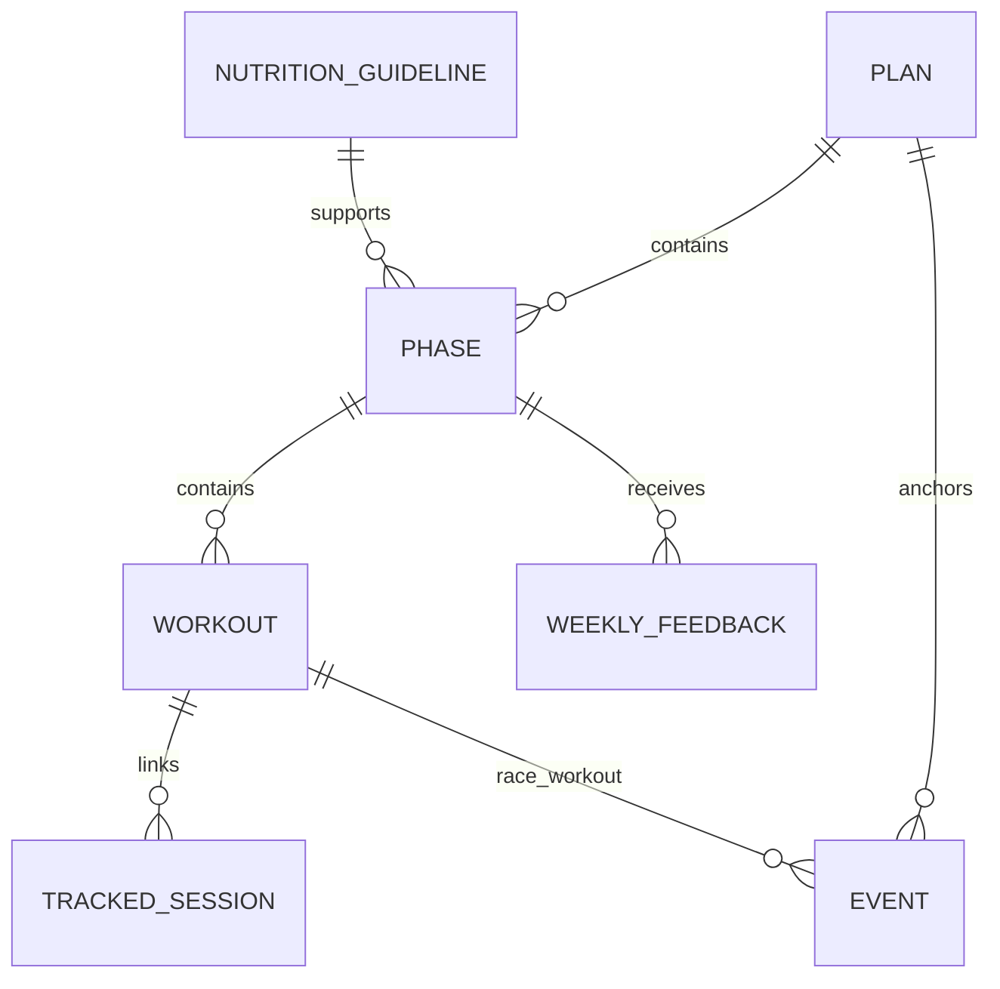

# Domain Model

This document defines the core training concepts that exist in the current backend and
the main rules that shape their behavior.

## Domain Goals

The backend models training as a structured system rather than a loose collection of
notes. The core goals of the v1 model are:

- represent planned training in a relational form
- link planned workouts to actual tracked sessions
- capture qualitative weekly feedback
- calculate status and training-load adherence in the backend
- build richer context snapshots for API consumers and AI analysis

## Core Entities

## Plan

Represents the highest-level training block.

Key fields:

- `name`
- `plan_goal`
- `constraints`
- `rules_weekly_rhythm`
- start and end date ranges

Relationships:

- has many `Phase`
- has many `Event` rows

## Phase

Represents a structured segment inside a plan.

Key fields:

- `name`
- `phase_type`
- `notes`
- `focus_tags`
- `weekly_structure`
- timeframe start/end

Relationships:

- belongs to a `Plan`
- optionally links to a `NutritionGuideline`
- has many `Workout`
- has many `WeeklyFeedback`

## Workout

Represents the primary planning unit.

Key fields:

- planned timeframe (`date_start`, `date_end`, `date_is_datetime`)
- training descriptors such as `category`, `difficulty`, `equipment`, `impact`
- intention fields such as `purpose` and `metrics_to_record`
- planned metrics such as distance, duration, RPE, and planned training load
- actual metrics such as duration, distance, RPE, and actual training load
- lifecycle fields such as `status`, `cancelled`, and `skipped`
- `planned_week_number` and `planned_week_start_date`

Relationships:

- belongs to a `Phase`
- has many `TrackedSession`
- may be referenced by one or more `Event` rows as a race workout

## TrackedSession

Represents actual execution data imported from external systems and linked back to a
planned workout when possible.

Key fields:

- `source`
- `session_type`
- `external_id`
- start and end date ranges
- duration, distance, calories, heart-rate, cadence, elevation, and steps metrics

Relationships:

- optionally belongs to a `Workout`

## WeeklyFeedback

Represents qualitative athlete feedback captured per week.

Key fields:

- `week`
- `energy`
- `leg_freshness`
- `motivation`
- `recovery`
- `biggest_limitation`

Relationships:

- belongs to a `Phase`

## Event

Represents a race or milestone associated with a plan and, optionally, a specific race
workout.

Key fields:

- `name`
- `event_type`
- `sport`
- `priority`
- optional target metrics
- start and end timestamps
- `location`
- `status`

Relationships:

- optionally belongs to a `Plan`
- optionally points at a race `Workout`

## NutritionGuideline

Represents supporting guidance that can apply to one or more phases.

Key fields:

- `goal`
- `applies_to`
- `carb_strategy`
- macro targets
- hydration, supplement, and timing notes

Relationships:

- has many `Phase`

## Shared Identity Fields

Every persisted entity in the training model includes the `TrainingEntityMixin`, which
adds:

- local primary key `id`
- `notion_page_id`
- `notion_url`
- `notion_page_content`

This is what makes one-way sync and update matching possible.

## Relationship Summary



## Status Model

The backend calculates status in `domain/calculators/status_calculator.py`.

### Phase and Plan Status

Phase and plan statuses are derived from timeframe boundaries relative to an `as_of`
date.

Possible values:

- `Future`
- `Active`
- `Past`
- `Unknown`

`Unknown` is returned when timeframe data is missing or inconsistent.

### Workout Status

Workout status is derived from explicit flags, linked execution data, phase status, and
scheduled timing.

Possible values:

- `Open`
- `Done`
- `Missed`
- `Skipped`
- `Cancelled`
- `Unknown`

Decision precedence in the current implementation:

1. `Cancelled`
2. `Skipped`
3. `Done` when the workout has at least one linked session and a non-zero `actual_rpe`
4. `Missed` when the parent phase is already past
5. `Missed` when the workout timeframe is in the past
6. `Open` when the parent phase is future or active
7. `Open` when the workout timeframe is in the future
8. `Unknown`

This is an important v1 rule because it directly affects API responses, context data,
and adherence calculations.

## Training Metrics

The current backend calculates a focused set of metrics in
`domain/calculators/training_metrics_calculator.py`.

By default, metrics include workouts whose status is:

- `Done`
- `Skipped`
- `Open`

Current outputs:

- `planned_training_load`
- `actual_training_load`
- `Training Load Adherence`

Adherence is calculated as:

```text
actual_training_load / planned_training_load * 100
```

If planned load is zero, adherence is returned as `null`.

## Context Objects

The backend also defines richer, non-persistent domain views that are central to v1.

### Workout Context

Combines:

- metadata about the time of evaluation
- plan summary, if available
- phase summary, if available
- the resolved workout status
- detailed workout data including tracked sessions

### Phase Week Context

Combines:

- metadata for the requested week
- plan and phase summary
- resolved phase status
- workouts in the requested phase week
- adherence and training metrics for that week
- data-gap messages

### Phase Context

Combines:

- metadata for the evaluation time
- plan summary and full phase payload
- resolved phase status
- open workouts
- completed workouts with linked sessions
- weekly metrics across the phase
- adherence summary
- data-gap messages

## Data Gaps

The application layer explicitly reports domain data quality issues rather than hiding
them.

Examples of current `data_gaps` messages:

- missing phase timeframe, which prevents status resolution
- unlinked tracked sessions inside a phase timeframe
- workouts with `Unknown` status
- workouts that were missed

This is a strong v1 design choice because it keeps consumers and AI services grounded in
the known quality of the data they are using.
